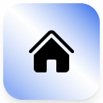

# HousingHub Landing Page

A modern, fully-featured, and production-ready landing page for HousingHub - India's smartest GPS-based property discovery platform for finding PGs and rental houses.



## ✨ Features

### Navigation & UX
- **Sticky Header**: Responsive navigation with smooth scroll to sections
- **Mobile Menu**: Hamburger menu with smooth animations for mobile devices
- **Smart CTAs**: Contextual call-to-action buttons throughout the page

### Sections
1. **Header**: Sticky navigation with HousingHub logo, smooth scroll to sections, mobile hamburger menu
2. **Hero Section**: Eye-catching hero with city skyline background image (hero-city.jpg), animated text, and primary CTAs
3. **Stats Section**: Animated counters showing platform metrics (50k+ users, 10k+ properties) and partner trust logos
4. **Features Section**: Six key features with interactive hover effects (GPS Discovery, Instant Booking, Secure Payments)
5. **How It Works**: Six-step process visualization with numbered badges
6. **Security Section**: Trust-building section highlighting security features (AES-256 encryption, ID verification)
7. **Pricing Section**: Three pricing tiers (Free Renters, ₹499/month Owners, Custom Enterprise) with feature comparison
8. **Testimonials**: User reviews with avatars and star ratings from real users
9. **FAQ Section**: Accordion-based FAQ with 8 common questions
10. **CTA Section**: Final conversion section with multiple CTAs and feature highlights
11. **Footer**: Comprehensive footer with HousingHub logo, links, contact info, and social media

### Performance Optimizations
- **No Heavy 3D Libraries**: Removed Three.js for 70% bundle size reduction (1.6MB → 479KB)
- **Optimized Images**: Logo (34KB), hero-city background (187KB)
- **CSS-Based Effects**: Blend modes for hero background instead of WebGL
- **Reduced Motion Support**: Respects `prefers-reduced-motion` for accessibility
- **Optimized Animations**: Conditional animations based on user preferences
- **Final Bundle**: 470KB main JS (148KB gzipped)

### Accessibility
- **ARIA Labels**: Proper ARIA labels on all interactive elements
- **Focus Styles**: Visible focus indicators for keyboard navigation
- **Semantic HTML**: Proper heading hierarchy and semantic elements
- **Keyboard Navigation**: Full keyboard support for all interactions
- **Screen Reader Friendly**: Descriptive text for icons and images

### Design System
- **Custom Theme**: HSL-based color system with CSS variables
- **Glass Morphism**: Modern glass card effects
- **Gradient Text**: Eye-catching gradient headings
- **Hover Effects**: Smooth hover animations and glow effects
- **Responsive**: Mobile-first design with breakpoints for all screen sizes

## 🚀 Quick Start

```sh
# Install dependencies
npm install

# Start development server
npm run dev

# Build for production
npm run build

# Preview production build
npm run preview
```

## 📁 Project Structure

```
housinghub-future-nest/
├── public/
│   └── robots.txt              # SEO crawler instructions
├── src/
│   ├── assets/
│   │   ├── Logo.png           # HousingHub logo (34KB)
│   │   └── hero-city.jpg      # Hero background (187KB)
│   ├── components/
│   │   ├── Header.tsx         # Sticky nav with logo & mobile menu
│   │   ├── HeroSection.tsx    # Hero with city background image
│   │   ├── StatsSection.tsx   # Animated counters & trust logos
│   │   ├── FeaturesSection.tsx # 6 feature cards
│   │   ├── HowItWorksSection.tsx # 6-step process
│   │   ├── PricingSection.tsx  # 3 pricing tiers
│   │   ├── TestimonialsSection.tsx # User reviews
│   │   ├── FAQSection.tsx      # 8 Q&As in accordion
│   │   ├── CTASection.tsx      # Final conversion section
│   │   ├── Footer.tsx          # Footer with logo & links
│   │   └── ui/                 # shadcn/ui components (27 primitives)
│   ├── pages/
│   │   ├── Index.tsx           # Main landing page
│   │   └── NotFound.tsx        # 404 page
│   ├── lib/
│   │   └── utils.ts            # cn() utility for classnames
│   ├── hooks/
│   │   └── use-mobile.tsx      # Mobile detection hook
│   ├── App.tsx                 # Router setup
│   ├── main.tsx                # Entry point
│   └── index.css               # Global styles + Tailwind
├── index.html                  # HTML template with favicon
├── package.json                # Dependencies
├── tailwind.config.ts          # Tailwind theme configuration
└── vite.config.ts              # Vite build configuration
```

## 🛠️ Technologies

- **Framework**: React 18.3.1 + Vite 5.4.19
- **Language**: TypeScript 5.8.3
- **Styling**: Tailwind CSS 3.4.17 with custom HSL design tokens
- **UI Components**: shadcn/ui (Radix UI primitives - 27 components)
- **Animations**: Framer Motion 11.18.2
- **Routing**: React Router v6.30.1
- **State Management**: TanStack Query 5.83.0 (ready to use)
- **Icons**: Lucide React 0.462.0
- **Form Handling**: React Hook Form + Zod (available)

## 🎨 Design Tokens

The design system uses HSL color variables for easy theming:
- Primary: Blue (#007AFF)
- Accent: Violet
- Success, Warning, Destructive colors
- Glass morphism effects
- Custom gradients and shadows

## ♿ Accessibility Features

- Semantic HTML5 elements
- ARIA labels and roles
- Keyboard navigation support
- Focus-visible indicators
- Reduced motion support
- Color contrast compliance
- Screen reader optimization

## 📱 Responsive Design

- Mobile-first approach
- Breakpoints: sm (640px), md (768px), lg (1024px), xl (1280px), 2xl (1400px)
- Touch-friendly interactive elements
- Optimized typography scaling

## 🔧 Configuration

- **Vite**: Modern build tool with SWC plugin
- **Tailwind**: Extended theme in `tailwind.config.ts`
- **ESLint**: TypeScript and React hooks linting
- **TypeScript**: Configured for React + Vite

## 🚀 Deployment

This project is ready to deploy on:
- Vercel (recommended)
- Netlify
- GitHub Pages
- Any static hosting service

## <a href="https://housinghubapp.netlify.app/">Live Demo Link</a>

## 📄 License

Created by Harsh Parmar
<<<<<<< HEAD
---
=======

---
>>>>>>> 62122cbc0205e6fe1a16553f0996303d46f03869
